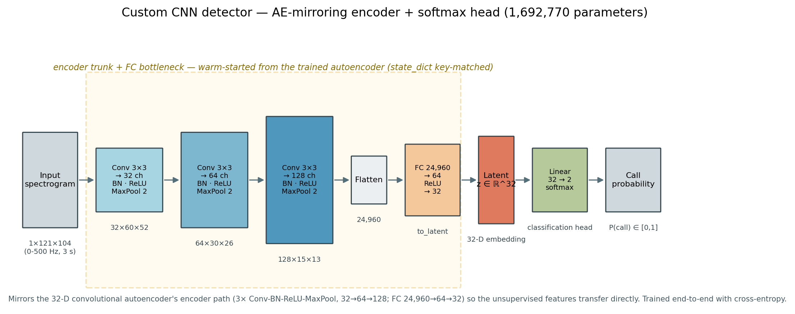

# BowheadWhaleDetector

Benchmarking supervised CNN classifiers against the unsupervised convolutional
autoencoder + k-nearest-neighbor pipeline for detecting bowhead whale calls in
DASAR passive-acoustic data (Beaufort Sea, 2007–2014).

Companion code for *"Enhancing bowhead whale detection using convolutional
autoencoders"* (Thode 2026, JASA).

## Benchmarks

All four pipelines emit a single **call-probability score** per spectrogram and
are scored on the **same grouped held-out test set** at **realistic prevalence**
(~1 call : 8 transients), so they are directly comparable.

| # | Pipeline | Status |
|---|----------|--------|
| 0 | Autoencoder 32-D latent + kNN (k=20) — *the existing baseline* | needs AE code from author |
| 1 | Custom CNN: AE encoder trunk + softmax head (warm-start vs random-init ablation) | scaffolded |
| 2 | BirdNET frozen embeddings + linear probe (native vs 10× speed-up shift) | planned |
| 3 | Perch 2.0 (+ Google Multispecies Whale Model) frozen embeddings + linear probe | planned |

Protocol for (2)/(3) mirrors Burns et al. 2025 ("Perch 2.0 transfers 'whale'"):
few-shot linear probing, k ∈ {4,8,16,32}, 5 repeats, ROC-AUC + PR. See
`docs/literature_review.md`.

## Two rigor invariants (apply to ALL pipelines)

1. **Grouped splits** — split by `unique_call` or `date×site`, never random
   per-image. One unique call produces multiple near-identical detections across
   DASARs A/D/G; random splitting leaks them across train/test and inflates
   metrics. See `bowhead/data/splits.py`.
2. **Realistic prevalence** — evaluate on a ~1:8 call:transient test set, not the
   balanced 1:1 training ratio. See `bowhead/eval/metrics.py`.

## Layout

```
bowhead/
  config.py            # experiment configuration dataclass
  data/
    dataset.py         # SpectrogramDataset + the data interface contract
    splits.py          # leakage-free grouped train/val/test splitting
  models/
    encoder.py         # AE encoder trunk (shared, warm-start compatible)
    custom_cnn.py      # Approach 1: encoder trunk + classification head
  train/
    train_cnn.py       # training loop for the custom CNN
  eval/
    metrics.py         # PR / ROC-AUC / prevalence-aware scoring
    evaluate.py        # unified Scorer protocol + comparable curve generation
docs/
  literature_review.md
```

## ⚠️ What's needed from the author to wire this up

The data loader (`bowhead/data/dataset.py`) is written against an *assumed*
schema. Drop in the autoencoder scripts + a small data sample and we'll adapt the
loader to the real on-disk format. Specifically we need to know:

- How the uint8 spectrogram images are stored (`.npy` / HDF5 / per-file?).
- The metadata table schema — must contain, per image: a **unique-call ID**,
  **date**, **site**, **DASAR**, the **call/non-call label**, and (for later
  multiclass) the **call type** and an **airgun** flag.
- Exact image dimensions (draft states both 121×104 and 128×119 — to reconcile).
- The trained AE checkpoint, for encoder warm-starting and the kNN baseline.

## ⚠️ Transfer benchmarks need AUDIO, not spectrogram images

The autoencoder, custom CNN, and AE+kNN pipelines run on the dB-SNR **spectrogram
images**. BirdNET/Perch/GMWM run on **raw audio waveforms**. So benchmarks 2 & 3
additionally require the underlying **~5 s audio clips** (omni channel, 1 kHz)
for each transient detection, index-aligned with the images. `bowhead/transfer/`
preprocesses those clips (native vs. 10× speed-up frequency-shift arms).

## Install / run

Use the **torch-enabled interpreter** — on this machine that is
`/usr/local/bin/python3.8` (torch 2.2.2, scikit-learn 1.3.2, numpy 1.24). The
default `python` (3.13) lacks torch.

```bash
pip install -r requirements.txt           # into the torch env
PYTHONPATH=. /usr/local/bin/python3.8 tests/test_smoke.py      # core pipeline
PYTHONPATH=. /usr/local/bin/python3.8 tests/test_transfer.py   # transfer scaffold
```

BirdNET/Perch backends (TensorFlow, `tensorflow_hub`, `librosa`) are installed on
the GPU cluster only — `bowhead/transfer/embedders.py` lazy-imports them so the
package imports fine without them.

## Data

`bowhead/data/build_dataset.py` converts the author's two per-file `.mat`
databases (Manual = verified calls → label 1; Auto = transients → label 0) into
the `data/spectrograms.npz` the pipeline consumes (121×104 uint8 grams +
metadata). The full build is ~200k images / ~1.1 GB and is git-ignored.

```bash
PYTHONPATH=. /usr/local/bin/python3.8 -m bowhead.data.build_dataset \
  --manual-dir <Unsupervised_database_Manual_*.dir> \
  --auto-dir   <Unsupervised_database_Auto_*.dir> \
  --out data/spectrograms.npz          # add --max-per-class N for a quick subset
```

## Architecture diagram



`docs/cnn_architecture.png` (+ `.svg`) is generated by *introspecting* the live
model, so it never drifts from the code:

```bash
PYTHONPATH=. /usr/local/bin/python3.8 -m bowhead.models.plot_architecture
```

## Training dashboard (TensorBoard)

Training writes scalars (train loss, val ROC-AUC) and an HPARAMS comparison
(warm-start vs scratch) to `runs/<tag>/`.

```bash
# the warm-start vs random-init ablation = these two runs
PYTHONPATH=. /usr/local/bin/python3.8 -m bowhead.train.train_cnn \
  --data data/spectrograms.npz --tag scratch
PYTHONPATH=. /usr/local/bin/python3.8 -m bowhead.train.train_cnn \
  --data data/spectrograms.npz --warm-start <ae_ckpt.pth> --tag warmstart

./deploy/launch_tensorboard.sh             # local  -> http://localhost:6006
./deploy/launch_tensorboard.sh --public    # +cloudflared instant (ephemeral) link
```

### Portfolio / hosting

A **persistent** public dashboard is deployed as a Hugging Face Space (Docker SDK
serving TensorBoard) — see [`deploy/tensorboard_space/`](deploy/tensorboard_space/).
TensorBoard.dev (the old free public hosting) was retired in 2024, so the Space
is the durable option. To (re)deploy after training:

```bash
# 1. refresh the committed log snapshot
rm -rf deploy/tensorboard_space/logs && cp -r runs deploy/tensorboard_space/logs
find deploy/tensorboard_space/logs -type f ! -name 'events.out.tfevents.*' -delete

# 2. push the Space folder to Hugging Face (one-time: create the Space first)
pip install huggingface_hub && huggingface-cli login
huggingface-cli repo create bowhead-tensorboard --type space --space_sdk docker
cd deploy/tensorboard_space && git init && git add . \
  && git commit -m "TensorBoard dashboard" \
  && git remote add origin https://huggingface.co/spaces/<your-username>/bowhead-tensorboard \
  && git push -u origin main
# -> live at https://huggingface.co/spaces/<your-username>/bowhead-tensorboard
```
